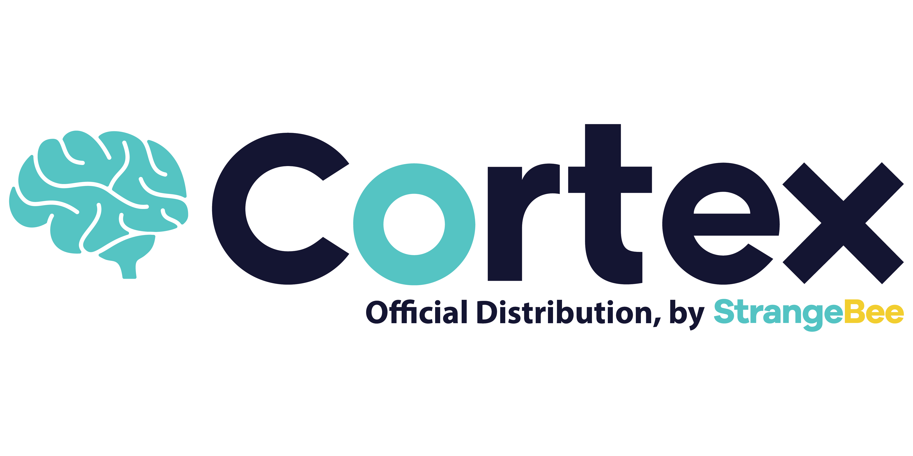
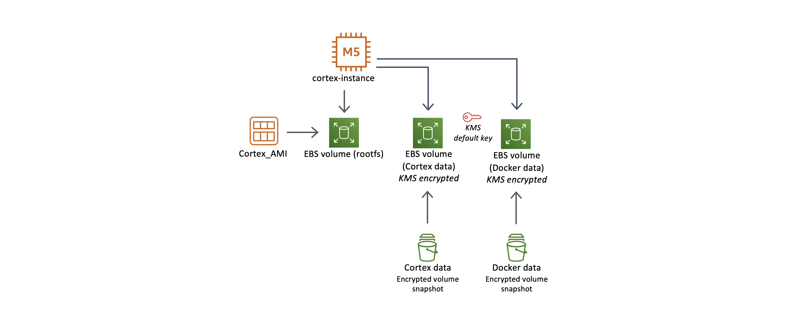

# Deploying Cortex with Terraform - launch new instance with existing data

Check our [detailed Medium post](https://medium.com/strangebee-hands-on/thehive-and-cortex-on-aws-ami-tutorials-part-2-launching-automatically-with-terraform-18459c5b9411) for more information on using this sample code.

The code itself is documented at lenght in our [AMI user guides](https://strangebee.com/aws).

This code will work out of the box with the reference *SecOps VPC* created with our sample code. You can nonetheless use it to deploy Cortex within your own preexisting VPC with minimal adjustments (only a few variables to update if your setup is similar to our reference architecture).

We provide two sets of sample code:

+ A first set to deploy a brand new Cortex install with an empty database - this is useful for an initial Cortex deployment.
+ A second set to deploy a new Cortex instance while restoring an existing database - this code is to be used for all other use-cases: Cortex update, instance type upgrade or downgrade, database restore, etc.

**This folder contains the code for the second use-case: launching a new Cortex instance while restoring data from existing volumes.**

# Overview

This is an overview of the resulting Cortex instance context and security group configuration when deployed with our Terraform sample code in our reference *SecOps VPC*.


## Information on the default data volume configuration
Cortex data and Docker images are stored on dedicated EBS volumes, not in the root EBS volume. This approach has many advantages:

+ Your root volume is disposable, you can replace your instance in seconds to update Cortex by launching a fresh AMI or to migrate to a more (or less) powerful instance type.
+ Your data and Docker volumes can be of any size while keeping the root volume to its default size. 
+ Increasing (or decreasing) the size of a data or Docker volume on an existing instance is a lot easier than changing the root volume size.
+ You can restore your database from a previous state using volume snapshots, see *Operations* section in the [AMI user guides](https://strangebee.com/aws). 



To restore existing data, you must provide the ids of existing Cortex data and Docker volumes (set the `secops-cortex-data-volume_id` and `secops-cortex-docker-volume_id` variables with the volume ids). Snapshots will be performed and used to populate the new volumes (the original volumes remain untouched).

**The data volume will be attached as `/dev/sdh` and the Docker volume as `/dev/sdi`.**

## About EBS volume management on Nitro based instances

In Nitro-based instances, `/dev/sdh` might be seen by the instance as something like `/dev/nvme0n1`. You need to take this into consideration for everything that is executed *inside* the instance. As far as the EC2 APIs are concerned, the volume is still known as `/dev/sdh`. More information on this is available in [Amazon EBS and NVMe on Linux Instances documentation](https://docs.aws.amazon.com/AWSEC2/latest/UserGuide/nvme-ebs-volumes.html#identify-nvme-ebs-device).

To illustrate this important aspect, consider the automated deployment of an instance using Terraform and some cloud-init user data code. In Terraform, you may want to change the default volumes size or base your EBS volumes on existing snapshots. Since Terraform is interacting with the EC2 APIs, the EBS volumes will alway be `/dev/sdh` and `/dev/sdi`. However, if you want to partition and format the volumes using cloud-init, you need to adapt your code to how the instance "sees" the volumes. In pre-Nitro instances the volumes will remain `/dev/sdh` and `/dev/sdi` but in Nitro instances, they will be known as something like `/dev/nvme0n1` and `/dev/nvme1n1`. 

To mount the volumes, the included Cortex initialisation and restore scripts were designed to be "Nitro-aware". These scripts expect the *block device mapping* as argument (such as `/dev/sdh` and `/dev/sdi`) and will then mount the volumes based on their UUID to avoid any confusion going forward. More detail on these scripts is provided in the *Operations* section of the [AMI user guides](https://strangebee.com/aws).

## Connecting to your Cortex instance with SSH
Since our Cortex instance is located in a private subnet, we cannot directly SSH into it using its private IP address. If you have set up a bastion host configuration similarly to our reference architecture, you can seamlessly connect to private instances using the *proxyjump* functionality of the ssh client. The bastion host will be able to perform the hostname resolution with the private DNS zone we have set up in the VPC. 

The easiest way to do that is to create (or update) the `~/.ssh/config` file. Use the example below as a reference and replace the ip addresses and private key information.

The default username for both the bastion host and Cortex instance is `ubuntu`.

```
Host bastion
				HostName 1.2.3.4 (public ip)
				User ubuntu
				Port 22
				IdentityFile ~/.ssh/id_rsa_private_key_for_bastion

Host cortex
				HostName cortex.secops.cloud
				User ubuntu
				Port 22
				ProxyJump bastion
				IdentityFile ~/.ssh/id_rsa_private_key_for_cortex
```

> *We use the secops.cloud domain as an example but the best security practice is to use a domain name you own even for private DNS resolution in split-horizon.*

You will now be able to SSH into the Cortex instance directly using the bastion host as a proxy:

```
ssh cortex 
```

**Note**: Remember to whitelist your local public IP address in the bastion security group. If you do not have a static IP address, you can regularly update the security group [using a Lambda function](https://medium.com/@griggheo/modifying-ec2-security-groups-via-aws-lambda-functions-115a1828cdb6).

---
Terraform compatibility: v0.12.x