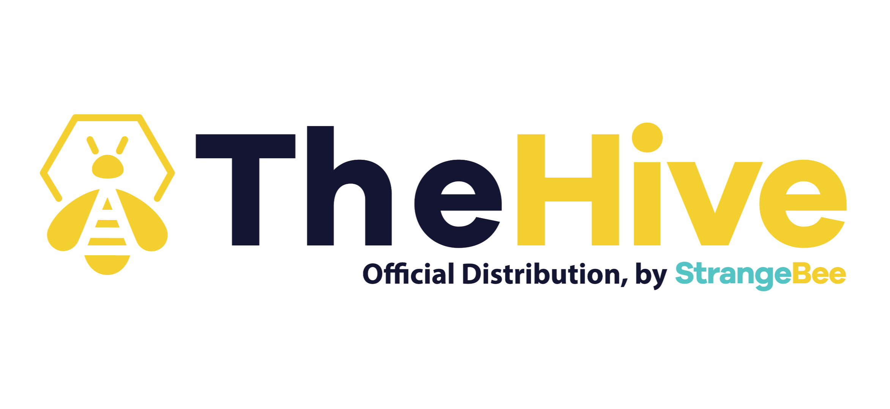
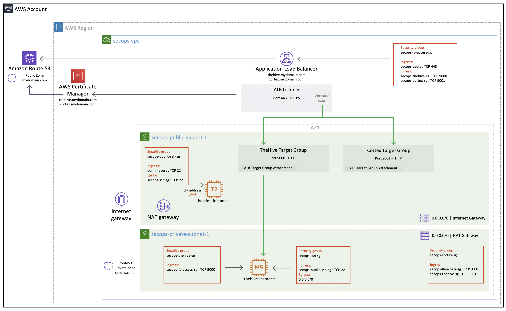
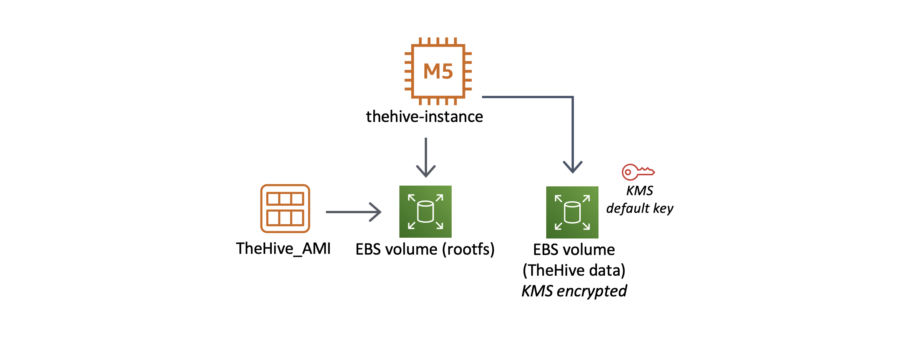

# Deploying TheHive with Terraform - launch new instance with an empty database

Check our [detailed Medium post](https://medium.com/strangebee-hands-on/thehive-and-cortex-on-aws-ami-tutorials-part-2-launching-automatically-with-terraform-18459c5b9411) for more information on using this sample code.

The code itself is documented at lenght in our [AMI user guides](https://strangebee.com/aws).

This code will work out of the box with the reference *SecOps VPC* created with our sample code. You can nonetheless use it to deploy TheHive within your own preexisting VPC with minimal adjustments (only a few variables to update if your setup is similar to our reference architecture).

We provide two sets of sample code:

+ A first set to deploy a brand new TheHive install with an empty database - this is useful for an initial TheHive deployment.
+ A second set to deploy a new TheHive instance while restoring an existing database - this code is to be used for all other use-cases: TheHive update, instance type upgrade or downgrade, database restore, etc.

**This folder contains the code for the first use-case: creating a brand new TheHive install with an empty database.**

# Overview

This is an overview of the resulting TheHive instance context and security group configuration when deployed with our Terraform sample code in our reference *SecOps VPC*.



## Information on the default data volume configuration
All TheHive data is stored on a dedicated EBS volume, not in the root EBS volume. This approach has many advantages:

+ Your root volume is disposable, you can replace your instance in seconds to update TheHive by launching a fresh AMI or to migrate to a more (or less) powerful instance.
+ Your data volume can be of any size while keeping the root volume to its default size. 
+ Increasing (or decreasing) the size of a data volume on an existing instance is a lot easier than changing the root volume size.
+ You can restore your database from a previous state using volume snapshots, see *Operations* section in the [AMI user guides](https://strangebee.com/aws). 



By default, the AMI will create a persistent 30GB EBS data volume at launch that will not be deleted when the instance is terminated so that your data isn't accidentally lost.

**The data volume will be attached as `/dev/sdh`.**

## About EBS volume management on Nitro based instances

In Nitro-based instances, `/dev/sdh` might be seen by the instance as something like `/dev/nvme0n1`. You need to take this into consideration for everything that is executed *inside* the instance. As far as the EC2 APIs are concerned, the volume is still known as `/dev/sdh`. More information on this is available in [Amazon EBS and NVMe on Linux Instances documentation](https://docs.aws.amazon.com/AWSEC2/latest/UserGuide/nvme-ebs-volumes.html#identify-nvme-ebs-device).

To illustrate this important aspect, consider the automated deployment of an instance using Terraform and some cloud-init user data code. In Terraform, you may want to change the default volume size or base your EBS volume on an existing snapshot. Since Terraform is interacting with the EC2 APIs, the EBS volume will alway be `/dev/sdh`. However, if you want to partition and format the volume using cloud-init, you need to adapt your code to how the instance "sees" the volume. In pre-Nitro instances the volume will remain `/dev/sdh` but in Nitro instances, it will be known as something like `/dev/nvme0n1`. 

To mount the volumes, the included TheHive initialisation and restore scripts were designed to be "Nitro-aware". These scripts expect the *block device mapping* as argument (such as `/dev/sdh`) and will then mount the volume based on its UUID to avoid any confusion going forward. More detail on these scripts is provided in the *Operations* section of the [AMI user guides](https://strangebee.com/aws).

## Connecting to your TheHive instance with SSH
Since our TheHive instance is located in a private subnet, we cannot directly SSH into it using its private IP address. If you have set up a bastion host configuration similarly to our reference architecture, you can seamlessly connect to private instances using the *proxyjump* functionality of the ssh client. The bastion host will be able to perform the hostname resolution with the private DNS zone we have set up in the VPC.

The easiest way to do that is to create (or update) the `~/.ssh/config` file. Use the example below as a reference and replace the ip addresses and private key information.

The default username for both the bastion host and TheHive instance is `ubuntu`.

```
Host bastion
				HostName 1.2.3.4 (public ip)
				User ubuntu
				Port 22
				IdentityFile ~/.ssh/id_rsa_private_key_for_bastion

Host thehive
				HostName thehive.secops.cloud
				User ubuntu
				Port 22
				ProxyJump bastion
				IdentityFile ~/.ssh/id_rsa_private_key_for_thehive
```

> *We use the secops.cloud domain as an example but the best security practice is to use a domain name you own even for private DNS resolution in split-horizon.*

You will now be able to SSH into the TheHive instance directly using the bastion host as a proxy:

```
ssh thehive 
```

**Note**: Remember to whitelist your local public IP address in the bastion security group. If you do not have a static IP address, you can regularly update the security group [using a Lambda function](https://medium.com/@griggheo/modifying-ec2-security-groups-via-aws-lambda-functions-115a1828cdb6).

---
Terraform compatibility: v0.12.x