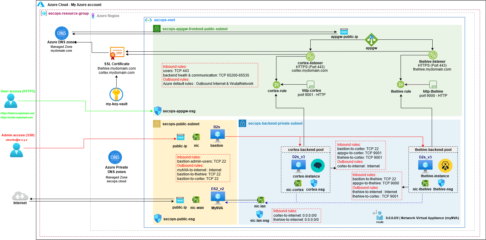

# Azure sample code

## Overview 

The sample Terraform code in this repository allows the creation of a complete SecOps virtual network (vnet) to host your TheHive and Cortex instances and expose them using an Application Gateway.

The sample code is organised in five folders:

* [ug-secops-vnet](ug-secops-vnet/) --> to create and manage the SecOps virtual network
* [ug-secops-thehive-new](ug-secops-thehive-new/) --> to launch a new TheHive instance with an empty database
* [ug-secops-thehive-migration](ug-secops-thehive-migration/) --> to launch a new TheHive instance with existing data (upgrade / replace scenario)
* [ug-secops-cortex-new](ug-secops-cortex-new/) --> to launch a new Cortex instance with an empty database
* [ug-secops-cortex-migration](ug-secops-cortex-migration/) --> to launch a new Cortex instance with existing data (upgrade / replace scenario)

This code organisation allows the creation of all required vnet resources if you do not already operate a vnet (or if you want to create a new one for your SecOps needs), independently from TheHive and Cortex deployments.

The sample code to launch TheHive and Cortex instances defaults to this new vnet but can easily be adapted to fit your existing vnet by customising a few variables. Unless your architecture significantly differs from our reference vnet, you should not be required to modify the Terraform code itself.
