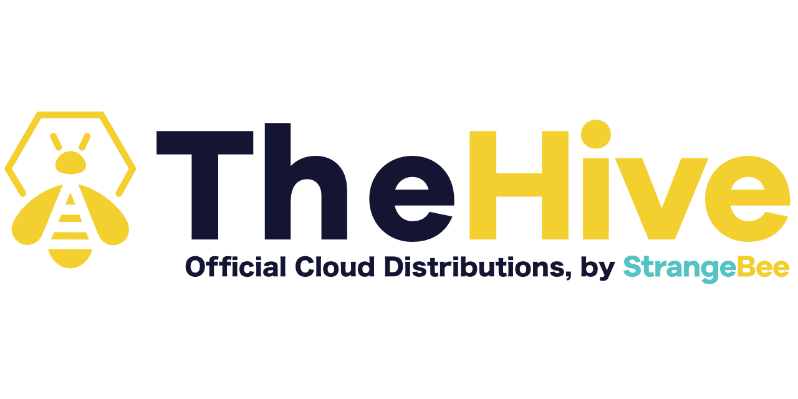
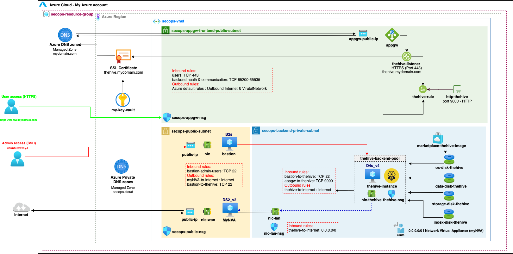

# Deploying TheHive v4 with Terraform - launch new instance with an empty database

This code will work out of the box with the reference *SecOps vnet* created with our sample code. You can nonetheless use it to deploy TheHive v4 within your own preexisting vnet with minimal adjustments (only a few variables to update if your setup is similar to our reference architecture).

We provide two sets of sample code:

+ A first set to deploy a brand new TheHive install with an empty database - this is useful for an initial TheHive deployment.
+ A second set to deploy a new TheHive instance while restoring an existing database - this code is to be used for all other use-cases: TheHive update, instance type upgrade or downgrade, database restore, etc.

**This folder contains the code for the first use-case: creating a brand new TheHive install with an empty database.**

## Overview

This is an overview of the resulting TheHive instance context and security group configuration when deployed with our Terraform sample code in our reference *SecOps vnet*.



## Information on the default data disks configuration
All TheHive data is stored on dedicated data disks, not in the OS disk. This approach has many advantages:

+ Your OS disk is disposable, you can replace your instance in seconds to update TheHive by launching a fresh image or to migrate to a more (or less) powerful instance.
+ Your data disks can be of any size while keeping the OS disk to its default size. 
+ Increasing (or decreasing) the size of a data disk on an existing instance is a lot easier than changing the OS disk size.
+ You can restore your database from a previous state using disk snapshots.

By default, the sample code will create three persistent data disks at launch that will not be deleted when the instance is terminated so that your data isn't accidentally lost:

+ A 16GB database disk (Cassandra), mounted at `/var/lib/elasticsearch`
+ A 8GB storage attachments disk mounted at `/opt/thp_data/files/thehive`
+ A 4GB database index disk (Lucene) mounted at `/opt/thp_data/index`

## Connecting to your TheHive instance with SSH
Since our TheHive instance is located in a private subnet, we cannot directly SSH into it using its private IP address. If you have set up a bastion host configuration similarly to our reference architecture, you can seamlessly connect to private instances using the *proxyjump* functionality of the ssh client. The bastion host will be able to perform the hostname resolution with the private DNS zone we have set up in the vnet.

The easiest way to do that is to create (or update) the `~/.ssh/config` file. Use the example below as a reference and replace the ip addresses and private key information.

The default username for both the bastion host and TheHive instance is `ubuntu`.

```
Host bastion
				HostName 1.2.3.4 (public ip)
				User ubuntu
				Port 22
				IdentityFile ~/.ssh/id_rsa_private_key_for_bastion

Host thehive
				HostName thehive.secops.cloud
				User ubuntu
				Port 22
				ProxyJump bastion
				IdentityFile ~/.ssh/id_rsa_private_key_for_thehive
```

> *We use the secops.cloud domain as an example but the best security practice is to use a domain name you own even for private DNS resolution in split-horizon.*

You will now be able to SSH into the TheHive instance directly using the bastion host as a proxy:

```
ssh thehive 
```

**Note**: Remember to whitelist your local public IP address in the bastion network security group. 

---
Terraform compatibility: v0.12.x
